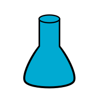

# Javascript Experiments

A couple of javascript programs I wrote back when I started programming.

## Further Information

* [Changelog](CHANGELOG)
* [License](LICENSE)
* [Gitlab](https://gitlab.namibsun.net/namibsun/museum/javascript-experiments)
* [Github](https://github.com/namboy94/javascript-experiments)
* [Progstats](https://progstats.namibsun.net/projects/javascript-experiments)